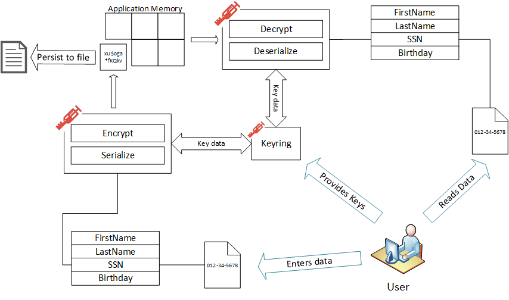

## Proxy-based Injectable Encryption Helper

CryptInject serves a simple purpose: help C# developers secure data within their software using robust modern encryption standards. 

Many developers rightfully view data security as a daunting task that's best left to "the experts." CryptInject, however, was designed with ease of use in mind. This helper binds to your existing data structure, enhancing it with extra fields to support in-memory encrypted data. 

CryptInject performs all the behind-the-scenes cryptographic magic as you access and change your properties. It helps you intercept functions to retrieve and change information in memory on an object associated with an encryptor, so that you don't have to expose the unencrypted data. You don't need to manage the encryption itself within your application, beyond creating its proxy.

If you require more advanced flexibility, you can slot in custom cryptographic and serialization functions. If you don't wish to add in custom functions, you can also select from an included palette of basic built-in routines.

### Keyrings
As a way to shortcut development for 3rd party users, a keyring management system has been provided to import and export keys. This can be achieved with the Import(), ImportFromStream() and ExportToStream() commands in the Keyring object. You can do partial exports on keyrings if so desired by specifying either the key names or the keys themselves. You can also import a keyring into another keyring, which will add any keys that are not already loaded into the keyring object.

*Keyrings, when exported, contain encryption keys without any protection. Developers should take this into account when storing keys.*

A keyring may only have one of each key name loaded at a time. The active keyring is always held in a static variable, at **EncryptionManager.Keyring**.

### Configuration
When preloading types, or when creating new proxies, the developer can pass a custom configuration to the proxy host. This applies only the first time the type being wrapped is seen. Subsequent calls to Create() (on the same object type) with configuration objects provided will use the original configuration given. This configuration can specify the following behaviors:
* **ProxySerializeFunction** - This event allows the developer to specify an alternate serialization strategy when encrypting objects. The default behavior is to use BinaryFormatter.
* **ProxyDeserializeFunction** - This event allows the developer to specify an alternate deserialization strategy when decrypting objects. The default behavior is to use BinaryFormatter.
* **ThrowExceptionOnAccessorFailure** - The default behavior is to return null (or default(T) where appropriate) if a value cannot be accessed. If this is set to true, an UnauthorizedAccessException will be thrown instead, for either a decryption failure or an instance where the required key is not loaded.
* **ThrowExceptionOnMutatorFailure** - The default behavior is to do nothing if a value cannot be changed. If this is set to true, an UnauthorizedAccessException will be thrown instead, for either an encryption failure or an instance where the required key is not loaded.

### EncryptionKey
All cryptographic wrappers inherit from EncryptionKey. If a developer wants to write their own cryptographic routines, it is necessary to extend this class.

The Key property is passed to the Encrypt and Decrypt method from the underlying library on demand; it is stored in protected memory and access to this secure information is managed by the library.

The State property is retained for when keys are being imported and exported, so any additional settings can be serialized and persisted by the developer of the cipher routine when managing keyrings.

It is advised that when developers create new key-based cryptography (instead of certificate-based), they provide a static "Create" method to generate cryptographically safe keys and initialization vectors.

### SerializerRedirect Attribute
The SerializerRedirect attribute is used on classes and properties to apply attributes to the proxy items. This is used to be able to add **constructorless** attributes like DataMember or Serializable to elements in the backing class to enable serialization of encrypted property stores.
```c#
// Example of SerializerRedirect -- This adds [DataMember] to the encrypted backing field for the "Integer" property.
[SerializerRedirect(typeof (DataMemberAttribute))]
public virtual int Integer { get; set; }
```

### The WPF Demo
Included is a rudimentary WPF-based demo, to show the flexibility of CryptInject in a situation where databinding is necessary. This application uses a set of random data to simulate viewing a list of medical records as entities.

The first time you open the application, there will be no data in the list. Click "Keyring Management" first. This allows you to see what keys are currently loaded.

Next, click "Generate Sample Keyring". This creates 3 keys that will be used by the sample entities: 'Sensitive Information', 'Semi-Sensitive Information', and 'Non-Sensitive Information'. These match the names given in the \[Encryptable\] attributes in the entity class. These keys are saved to the program directory as John.keyring and Jane.keyring. Jane's keyring is full-access, but John's keyring does not have the key necessary to view/change DOB and SSN.

Click "Import Partial Keyring". Select Jane's keyring and open it. Go back to the main window and click "Generate Data". This will generate our sample data and encrypt it using Jane's keyring. The data will be persisted to disk, so you can open the application in the future without having to generate the data again.

You can load and unload John and Jane's keyring to show what happens when you have different keys loaded onto the active keyring.

### Example
```c#
// Must implement serialization functions; this is how the encryptor serializes the object into bytes
static void Main()
{
    var binaryFormatter = new BinaryFormatter();
    binaryFormatter.Binder = new EncryptionProxySerializationBinder();

    // Create 3 new keys with randomly generated key material
    var keyring = new Keyring();
    keyring.Add("Sensitive Information", AesEncryptionKey.Create(TripleDesEncryptionKey.Create()));
    keyring.Add("Semi-Sensitive Information", TripleDesEncryptionKey.Create());
    keyring.Add("Non-Sensitive Information", TripleDesEncryptionKey.Create());

    using (var keyringExportStream = new FileStream("keyring.dat", FileMode.Create))
    {
        // Export only 2 of the 3 keys we created, for example...
        keyring.ExportToStream(keyringExportStream, "Non-Sensitive Information", "Semi-Sensitive Information");
    }

    using (var keyringImportStream = new FileStream("keyring.dat", FileMode.Open))
    {
        EncryptionManager.Keyring.ImportFromStream(keyringImportStream);
    }

    // Create a new instance of the object you're serializing (class for this is below)
    var proxy = EncryptionManager.Create<DataObjectInstance>();
    proxy.Integer = 12; // this won't work because we only exported 2 of the 3 keys and this is annotated with the third key :)
    proxy.String = "abc";
    proxy.Member = EncryptionManager.Create<InnerObject>();
    proxy.Member.HelloStr = "Hello, world!";

    Console.WriteLine("Before lock: " + proxy.Integer + ", '" + proxy.String + "', '" + proxy.Member.HelloStr + "'");

    // Lock out access to all keys (and clear cached values)
    EncryptionManager.Keyring.Lock();

    // Serialize to a stream
    var msOut = new MemoryStream();
    binaryFormatter.Serialize(msOut, proxy);

    // Rewind and deserialize back to a new object (notice the "as {original type}" here)
    msOut.Seek(0, SeekOrigin.Begin);
    var resultObj = binaryFormatter.Deserialize(msOut) as DataObjectInstance;

    Console.WriteLine("Before unlock: " + resultObj.Integer + ", '" + resultObj.String + "', '" + resultObj.Member.HelloStr + "'");
    EncryptionManager.Keyring.Unlock();
    Console.WriteLine("After unlock: " + resultObj.Integer + ", '" + resultObj.String + "', '" + resultObj.Member.HelloStr + "'");
}
```

#### DataObjectInstance Class
```c#
[Serializable]
[SerializerRedirect(typeof (SerializableAttribute))]
public class DataObjectInstance
{
    public InnerObject Member { get; set; }

    [Encryptable("Sensitive Information")]
    public virtual int Integer { get; set; }

    [Encryptable("Non-Sensitive Information")]
    public virtual string String { get; set; }
}

[Serializable]
[SerializerRedirect(typeof (SerializableAttribute))]
public class InnerObject
{
    [Encryptable("Semi-Sensitive Information")]
    public virtual string HelloStr { get; set; }
}
```
#### Data Flow Diagram

